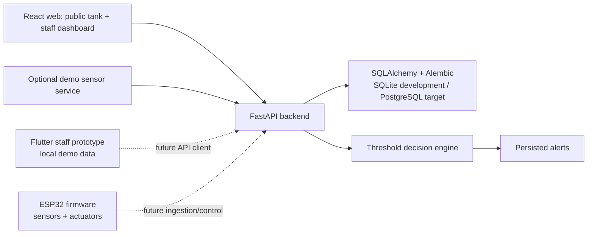

# AquaLogic Architecture

Status: Current implementation architecture
Last reviewed: 2026-07-27

## System overview

## Repository boundaries

### Backend

`backend/app/main.py` creates the FastAPI application, configures CORS, performs
development startup initialization, starts the optional demo sensor service,
and includes the route modules. The main implementation areas are:

- `app/models/`: SQLAlchemy persistence models.
- `app/schemas/`: Pydantic request and response models.
- `app/routes/`: auth, tanks, fish, sensors, alerts, public, management, and
  dashboard endpoints.
- `app/services/decision_engine.py`: threshold checks, status calculation, and
  alert creation.
- `app/services/demo_sensor.py`: opt-in local reading generation.
- `alembic/versions/`: database schema history.
- `tests/`: API and behavior tests using an isolated test database.

### Web

`web/src/app/` owns application composition, providers, routing, and lazy route
loaders. `web/src/features/` contains feature-level pages and styles. The
`shared/` directory contains the API client, shared models, reusable components,
hooks, and formatting utilities. `layouts/admin/` owns the persistent staff
navigation shell.

The web application has two trust boundaries:

- `/tank/:publicId` is public and read-only.
- `/admin/*` requires authenticated staff access, with admin-only operations
  enforced by the backend as well as reflected in navigation.

### Mobile

`mobile_app/` is a Flutter prototype. Its current readings, alerts, fish data,
and control interactions are built from local demo data. It should not be
described as a backend client until an API client, authentication, and loading /
offline behavior are implemented.

### Firmware

`Aqualogic.ino` and the sibling library directories contain the embedded
starting point. Firmware integration should eventually send small, explicit
sensor payloads and receive validated commands. It is intentionally separated
from current web and backend work.

## Runtime data flow

1. Staff or a future device submits a sensor reading for a tank.
2. The backend persists the reading.
3. The decision engine evaluates enabled threshold configurations.
4. Warning or critical alerts are created when values violate configured bounds,
   while unresolved alert duplication is controlled by the service logic.
5. Authenticated web clients read fleet, history, alerts, and analytics data.
6. Public web clients read a restricted tank view by public ID.

## Deployment direction

Local development uses the backend and Vite development server. `render.yaml`
contains the current Render API configuration, and `web/vercel.json` contains
the web proxy configuration, but cloud resources have not been provisioned or
fully validated. The intended production path is an explicit PostgreSQL
database, controlled CORS, a unique JWT secret, and a deployed web client.
