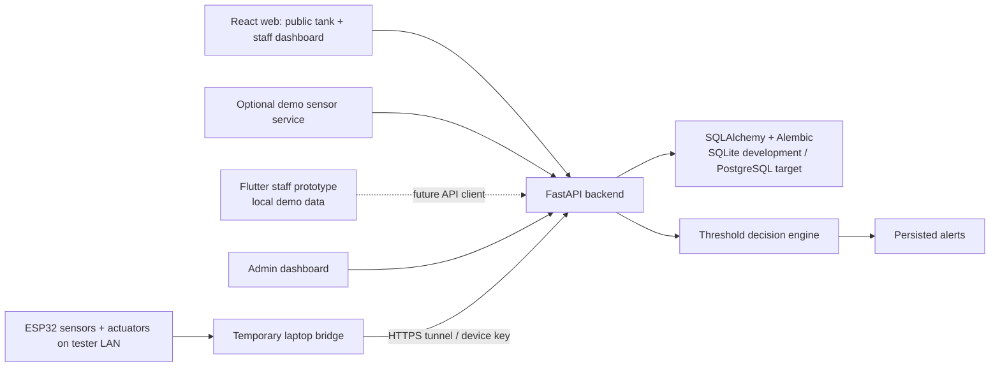

# AquaLogic Architecture

Status: Current implementation architecture
Last reviewed: 2026-08-15

## System overview

## Repository boundaries

### Backend

`backend/app/main.py` creates the FastAPI application, configures CORS, performs
development startup initialization, starts the optional demo sensor service,
and includes the route modules. The main implementation areas are:

- `app/models/`: SQLAlchemy persistence models, including registered devices,
  actuator commands, current actuator state, and state history.
- `app/schemas/`: Pydantic request and response models.
- `app/routes/`: auth, tanks, fish, sensors, devices, alerts, public, management,
  and dashboard endpoints. `devices.py` owns fixed-tank sensor ingestion and
  the device-key actuator boundary.
- `app/services/decision_engine.py`: threshold checks, status calculation, and
  alert creation.
- `app/services/species_suitability.py`: pure, staff-only derived species-care
  evaluation using the latest sensor reading and species preference fields.
- `app/services/demo_sensor.py`: opt-in local reading generation.
- `alembic/versions/`: database schema history.
- `tests/`: API and behavior tests using an isolated test database.

### Web

`web/src/app/` owns application composition, providers, routing, and lazy route
loaders. `web/src/features/` contains feature-level pages and styles. The
`shared/` directory contains the API client, shared models, reusable components,
hooks, and formatting utilities. `layouts/admin/` owns the persistent staff
navigation shell.

The web application has two trust boundaries:

- `/tank/:publicId` is public and read-only.
- `/admin/*` requires authenticated staff access, with admin-only operations
  enforced by the backend as well as reflected in navigation.

Authentication uses a short-lived HS256 access JWT held only in browser memory
and a rotating opaque refresh token held in a Strict, HttpOnly cookie. Every
authenticated request checks the JWT claims, user token version, and active
database session. Hash-only refresh/setup tokens, database throttles, and
append-only audit events support revocation and incident review.

### Mobile

`mobile_app/` is a Flutter prototype. Its current readings, alerts, fish data,
and control interactions are built from local demo data. It should not be
described as a backend client until an API client, authentication, and loading /
offline behavior are implemented.

### Firmware

`Aqualogic.ino` and the sibling library directories contain the embedded
starting point. Firmware integration should eventually send small, explicit
sensor payloads and receive validated commands. It is intentionally separated
from current web and backend work.

## Runtime data flow

1. Staff submits a manual reading for a tank, or a registered bridge device
   authenticates with a device key. Device keys resolve to one server-side tank;
   bridge requests cannot choose a tank.
2. The backend persists the reading.
3. The decision engine evaluates enabled threshold configurations.
4. Warning or critical alerts are created when values violate configured bounds,
   while unresolved alert duplication is controlled by the service logic.
5. Authenticated web clients read fleet, history, alerts, and analytics data.
6. Public web clients read a restricted tank view by public ID.

For actuator control, an admin queues a server-generated command for the fixed
device/tank mapping. The bridge fetches only unexpired commands using the
registered device key, claims one before making the matching allowlisted local
GET request, and reports `executing`, `succeeded`, or `failed`. The backend
records the admin actor, validated payload, expiry, timestamps, result/error,
and append-only state reports. Staff users receive 403 for actuator command,
state, and history endpoints.

The ESP32 bridge is temporary test infrastructure. It polls the local firmware
`/data` endpoint and forwards four installed sensors, then polls pending admin
commands through the backend. UV, normal LED, feeder, and manual-test-only
Syringe Pump A/B actions are allowlisted. Pump dispense sends the firmware's
exact `/syringeA/dispense` or `/syringeB/dispense` route once, waits only for
the validated short cutoff, and sends the matching stop route as a safety
cutoff. Hardware calls are not automatically retried after an ambiguous
response because the actuator may already have run. Dissolved oxygen and
ammonia remain nullable/unavailable, are skipped by threshold evaluation, and
have no actuator or command path.

The browser and backend never connect directly to the ESP32. Tunnel
infrastructure is limited to temporary dashboard/API testing; the ESP32 stays
on the tester's private Wi-Fi and is never exposed to the internet. Pump
schedules, pH auto-dose, and automatic dosing from sensor data remain outside
the command allowlist.

Species-care evaluation is a parallel read path: an authenticated tank drawer
loads the tank's assignments and one latest reading, then returns a dynamic
care result. It shares only the 90-second reading-freshness helper with the
decision engine; operational thresholds and persisted Alert records remain
separate.

The staff web surface separates the tank directory (`/admin/tanks`), the
administrator actuator chooser (`/admin/actuators`), the bookmarkable
operations workspace (`/admin/tanks/:tankId`), the dedicated
administrator actuator control center (`/admin/tanks/:tankId/actuators`), and
the shared configuration drawer (`?edit=`). The detail route owns live
operations and care polling, assignments, alert resolution, and a compact
actuator snapshot; the dedicated actuator route owns full controls, pump-test
safety prompts, and paginated command history. The chooser only selects a tank
view; both actuator surfaces reuse the same backend command boundary, and the
page routes do not replace backend authorization.

## Deployment direction

Local development uses the backend and Vite development server. `render.yaml`
contains the current Render API configuration, and `web/vercel.json` contains
the web proxy configuration, but cloud resources have not been provisioned or
fully validated. The intended production path is an explicit PostgreSQL
database, controlled CORS and trusted hosts, a unique JWT secret, disabled demo
generation, and a deployed web client. Production startup rejects unsafe
configuration rather than falling back to development defaults.
