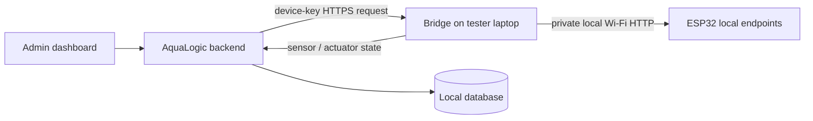

# ESP32 Bridge Integration Plan

Status: v1 UV/LED/feeder controls plus Pump A/B manual-test bridge implemented
for temporary hardware testing
Last reviewed: 2026-08-17

## Goal and boundary

AquaLogic now supports a first, admin-only control phase without changing the
received ESP32 firmware, pins, wiring, or Wi-Fi behavior. Sensor ingestion stays
read-only and continues to poll the firmware `GET /data` endpoint. Actuator
commands travel through the existing laptop bridge:



The browser and backend never call the ESP32 directly. The bridge is the only
component allowed to call local actuator routes. A tunnel may expose the
dashboard/API during a test, but the ESP32 is never tunneled or published.

## Firmware endpoint map used by v1

The current ESP32 reference registers these supported routes. The bridge
translation is intentionally exact:

| AquaLogic action | ESP32 route | Query parameters | Expected response |
| --- | --- | --- | --- |
| UV status | `GET /uv/status` | none | `led_on`, `remaining_ms`, `total_on_ms`, `schedule_enabled`, `sched_on`, `sched_off` |
| UV on/off | `GET /uv/on`, `GET /uv/off` | none | `{"led":"on"}` / `{"led":"off"}` |
| UV timer | `GET /uv/timer` | `duration` milliseconds | `{"led":"timer"}` |
| UV schedule | `GET /uv/schedule` | `enabled`, `onH`, `onM`, `offH`, `offM` | `{"schedule":"saved"}` |
| LED status | `GET /led/status` | none | same light status shape |
| LED on/off | `GET /led/on`, `GET /led/off` | none | `{"led":"on"}` / `{"led":"off"}` |
| LED timer | `GET /led/timer` | `duration` milliseconds | `{"led":"timer"}` |
| LED schedule | `GET /led/schedule` | `enabled`, `onH`, `onM`, `offH`, `offM` | `{"schedule":"saved"}` |
| Feeder status | `GET /feeder/status` | none | `feeding`, `feed_count`, `last_fed`, `open_angle`, `duration_ms`, three schedule slots |
| Feed now | `GET /feeder/feed` | none | `{"fed":true}` |
| Feeder configuration | `GET /feeder/config` | `angle`, `duration` milliseconds | `{"config":"saved"}` |
| Feeder schedule | `GET /feeder/schedule` | `h0/m0/e0` through `h2/m2/e2` | `{"schedule":"saved"}` |
| Pump A status | `GET /syringeA/status` | none | `active`, `dose_count`, `last_dispensed`, `volume_ml`, three schedule slots |
| Pump A dispense test | `GET /syringeA/dispense` | none; bridge waits for configured `volume_ml` completion | `{"dispensed":true}` |
| Pump A stop | `GET /syringeA/stop` | none | `{"stopped":true}` |
| Pump A retract | `GET /syringeA/retract` | none | `{"retracted":true}` |
| Pump B status | `GET /syringeB/status` | none | same pump status shape |
| Pump B dispense test | `GET /syringeB/dispense` | none; bridge waits for configured `volume_ml` completion | `{"dispensed":true}` |
| Pump B stop | `GET /syringeB/stop` | none | `{"stopped":true}` |
| Pump B retract | `GET /syringeB/retract` | none | `{"retracted":true}` |

The bridge never calls `/feeder/test`, pump schedule/config/jog routes, or any
`/ph/auto/*` route. Pump schedules, pH auto-dose, and sensor-driven dosing
remain out of scope.

## Backend command contract

An administrator provisions one device key once and the server fixes that
device to one tank. The device key is shown only at provisioning and is stored
as a hash. Staff passwords, browser JWTs, and browser sessions are never used
by the bridge.

The migration `0008_actuator_controls` adds:

- `actuator_commands`: command ID, fixed device/tank, admin actor, validated
  action/payload, expiry, lifecycle status, execution timestamps, result, and
  error;
- `actuator_states`: latest validated state for UV, LED, feeder, and Pump A/B; and
- `actuator_state_history`: append-only state reports for diagnostics.

Admin routes:

```text
POST /tanks/{tank_id}/actuators/commands
GET  /tanks/{tank_id}/actuators/status
GET  /tanks/{tank_id}/actuators/history?page=1&page_size=10
```

Device-key bridge routes:

```text
GET  /device-ingestion/actuators/pending
POST /device-ingestion/actuators/{command_id}/executing
POST /device-ingestion/actuators/{command_id}/succeeded
POST /device-ingestion/actuators/{command_id}/failed
POST /device-ingestion/actuator-state
```

Commands are `queued`, `executing`, `succeeded`, `failed`, or `expired`.
Queued light/feeder commands expire after 120 seconds by default; pump commands
expire after 20 seconds by default and never exceed 30 seconds. No command
appears in a pending response after expiry. The backend only allows the device mapped to the
target tank to claim a command. Claim and final reporting are idempotent;
already-final commands cannot be physically reissued.

History is newest-first and paginated. `page_size` defaults to 10 and is capped
at 50; optional exact-match `actuator` and lifecycle `status` filters narrow the
audit view. The response includes `items`, `total`, `total_pages`, previous/next
flags, and a fixed-device lifecycle `summary` with queued, executing, succeeded,
failed, and expired counts. The admin dashboard never loads an unbounded audit
list; each row uses human-readable actuator/action labels, and details such as
the command ID, validated request, timestamps, and reported result/error remain
available through an expandable detail view.

Validation limits are deliberately narrower than an unconstrained query
string: light timers are 1–86,400,000 ms, schedule times are `HH:MM`, feeder
angles are 0–180, feeder durations are 500–60,000 ms, and the feeder has exactly
three schedule slots. Pump dispense payloads are empty because the current
firmware owns the configured volume; the bridge completion timeout is bounded
to the tester configuration, pump commands expire within 30 seconds, and pump
queue requests require a fresh bridge heartbeat.

## Bridge implementation

The implementation is [`../bridge/esp32_bridge.py`](../bridge/esp32_bridge.py).
Each cycle:

1. polls `/data`, validates the four installed readings, and posts them through
   `/device-ingestion/readings` using the device key;
2. polls `/device-ingestion/actuators/pending`;
3. validates the command, expiry, and pump safety flag locally;
4. claims it as `executing`;
5. makes the matching allowlisted ESP32 actuator request; a pump dispense then
   polls its status until the firmware-configured volume completes and makes
   one intentional matching stop request only if the bounded safety timeout is
   reached; and
6. reports success/failure and refreshes the corresponding local state.

Hardware calls are never retried automatically after a timeout or ambiguous
response because the actuator may already have run. Backend polling and state
reporting can use normal connection/backoff handling without reissuing a
physical command. Pump actions are rejected and reported as failed when
`pump_manual_test_enabled` is false (the default). Logs contain no device key,
Wi-Fi information, or sensitive configuration.

## Owner/tester commands

From the nested repository root, the owner starts the local services:

```powershell
.\start-esp32-bridge-owner.bat
```

Or manually:

```powershell
cd backend
.\.venv\Scripts\activate
alembic upgrade head
python -m uvicorn app.main:app --host 127.0.0.1 --port 8000
```

```powershell
cd web
npm run dev -- --host 127.0.0.1 --port 5173
```

Create one temporary HTTPS tunnel to the dashboard port only. Use its `/api`
path as the bridge backend URL. Provision the device with an admin session:

```powershell
curl.exe -X POST http://127.0.0.1:8000/devices `
  -H "Authorization: Bearer <ADMIN_JWT>" `
  -H "Content-Type: application/json" `
  -d '{"device_id":"esp32-test-01","tank_id":<TANK_ID>}'
```

Copy the returned one-time key into an untracked local
`bridge/bridge-config.json`. Start the tester bridge with:

```powershell
Copy-Item bridge/bridge-config.example.json bridge/bridge-config.json
# Fill only local test values; do not commit this file.
python bridge/esp32_bridge.py --config bridge/bridge-config.json --once
python bridge/esp32_bridge.py --config bridge/bridge-config.json
```

The tester laptop must be on the same private Wi-Fi as the ESP32. Its config
must use the local `/data` URL, the owner tunnel's `/api` URL, the one-time
device key, and the safe polling values from the example file. Keep
`pump_manual_test_enabled` false except during a controlled empty-syringe or
water-only motor test; set it to true only for that test window. Do not create a
tunnel to the ESP32.

## Explicit exclusions and success criteria

Excluded: pump schedules, pH auto-dose, automatic dosing from sensor data,
direct ESP32-to-backend posting, firmware changes, pin/wiring changes, Wi-Fi
credential changes, and production deployment. Pump manual tests are limited
to empty syringes or water and require `pump_manual_test_enabled: true` only
during controlled testing.

The phase is successful when a valid sensor poll still ingests readings, an
admin can queue and audit the allowed UV/LED/feeder controls and controlled Pump
A/B manual tests, the bridge reports local state and failure results, staff
receives 403 from actuator APIs, expired commands are not executed, and the
ESP32 remains private local-only. Stop all tunnels and bridge processes after
the hardware test.
