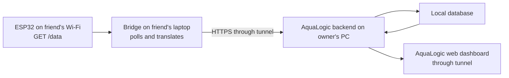

# ESP32 Bridge Integration Plan

Status: Implemented for temporary hardware testing
Last reviewed: 2026-08-14

Implementation status: Completed for temporary hardware testing.

## Goal

Show live ESP32 water readings in AquaLogic without modifying the received
ESP32 firmware during the first hardware test.

The initial integration is read-only. AquaLogic will ingest and display:

- water temperature in °C;
- pH;
- turbidity in NTU; and
- total dissolved solids (TDS) in ppm.

Dissolved oxygen and ammonia are deferred. They must be shown as unavailable,
not submitted as zero and not interpreted as safe readings.

## Approach: temporary bridge

The received ESP32 firmware already provides a local HTTP endpoint:

```text
GET http://<esp32-local-ip>/data
```

It returns the following calibrated fields:

| ESP32 field | AquaLogic field | Unit |
| --- | --- | --- |
| `temp_c` | `temperature` | °C |
| `ph_value` | `ph` | pH scale |
| `turbidity_ntu` | `turbidity` | NTU |
| `tds_ppm` | `tds` | ppm |

The bridge is a small program run on a laptop connected to the same Wi-Fi as
the ESP32. It polls `/data`, validates/translates those fields, then submits
them to an authenticated AquaLogic device-ingestion endpoint.



The bridge does not control any actuator and does not expose the ESP32 to the
internet.

## Test environment

### Owner's computer

- Run the FastAPI backend and local database.
- Run the Vite web dashboard.
- Expose the Vite dashboard through one public HTTPS tunnel.
- Provide the bridge with that tunnel URL plus `/api`; Vite forwards it to the
  local backend.
- Share the dashboard tunnel URL with testers.

### Hardware tester's computer

- Connect to the same Wi-Fi network as the ESP32.
- Identify the ESP32's local IP address from the serial monitor or LCD.
- Run the bridge with the ESP32 URL, AquaLogic backend tunnel URL, and a
  device-specific key.
- Use the shared dashboard URL to verify received readings.

## Planned implementation order

1. Capture a fixture containing a representative ESP32 `/data` response.
2. Add backend support for partial hardware readings and explicit unavailable
   parameters.
3. Add a registered-device model, one device key per device, and a read-only
   ingestion endpoint that maps the device to a single tank.
4. Build the bridge with configurable polling interval, timeouts, validation,
   retry/backoff, and clear console logs.
5. Add automated tests using the saved ESP32 response fixture; cover invalid,
   stale, and unreachable-device cases.
6. Update web dashboard freshness and unavailable-parameter presentation.
7. Perform one-device/one-tank hardware test using the tunnel setup.
8. Compare readings with manual or calibration-reference measurements and log
   only confirmed issues for follow-up.

## Current hardware baseline

The firmware and pin assignments are not changed in this phase. The firmware
source remains the technical source of truth until the physical board can be
verified. The handwritten pin diagram conflicts with the firmware's TDS and
turbidity assignments; record this for physical verification, but do not
rewire or alter firmware based solely on the diagram.

The existing ESP32-hosted dashboard remains an on-network fallback during
testing.

## Explicitly out of scope

- ESP32 firmware changes, including direct posting to AquaLogic.
- Pin changes or hardware rewiring.
- Dissolved oxygen and ammonia sensor support.
- Feeder, LED, syringe pump, and automatic dosing control from AquaLogic.
- Public exposure of ESP32 control endpoints.
- Production deployment; tunnels are temporary testing infrastructure only.

## Success criteria

- A valid ESP32 `/data` response creates a reading for the mapped test tank.
- The AquaLogic dashboard shows temperature, pH, turbidity, TDS, observation
  time, and device freshness.
- Dissolved oxygen and ammonia display as unavailable.
- An unreachable ESP32 produces a visible stale/offline state rather than a
  fabricated sensor reading.
- No AquaLogic action can trigger an ESP32 actuator.

## Implemented v1 protocol and commands

The bridge implementation is [`../bridge/esp32_bridge.py`](../bridge/esp32_bridge.py).
It only calls the ESP32's local `GET /data`, forwards `temp_c`, `ph_value`,
`turbidity_ntu`, and `tds_ppm`, and never calls an actuator endpoint.

An administrator provisions the fixed server-side device-to-tank mapping once:

```powershell
curl.exe -X POST http://127.0.0.1:8000/devices -H "Authorization: Bearer <ADMIN_JWT>" -H "Content-Type: application/json" -d '{"device_id":"esp32-test-01","tank_id":<TANK_ID>}'
```

Record the returned `device_key` in the tester's local bridge configuration;
the bridge does not use a staff credential. Copy
`bridge/bridge-config.example.json` to an untracked local `bridge-config.json`,
fill in placeholder values, then run:

```powershell
python bridge/esp32_bridge.py --config bridge-config.json
```

Use `--once` for a single diagnostic poll. The backend accepts bridge reads at
`POST /device-ingestion/readings` with `X-Device-Key`; the request cannot carry
or override a tank ID. It persists null only for the not-installed dissolved
oxygen and ammonia sensors and reports those metrics as unavailable.

## Before the hardware test

- Rotate the Wi-Fi password embedded in shared firmware and move it to a local,
  untracked firmware secrets file.
- Confirm the test tank and the hardware tester's laptop have the bridge
  runtime installed.
- Generate a device key; do not use a staff password or browser session token.
- Keep the owner computer awake and its backend/dashboard/tunnel processes
  running for the entire session.
